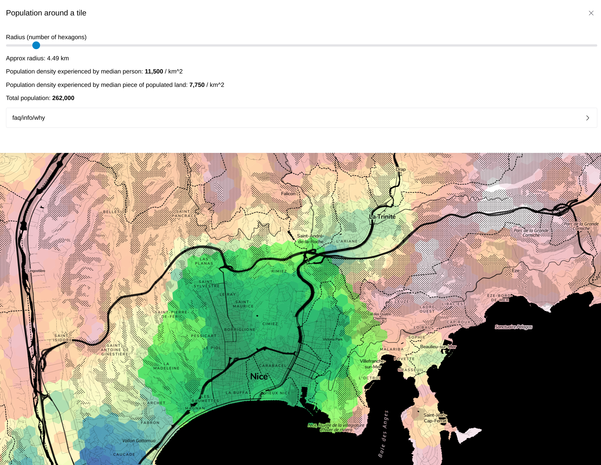

# Population around a tile

https://o.blanthorn.com/population-around-a-tile/map/

A simple data vis tool using MapLibre GL and deck.gl to display and refresh data from a CSV file.

# How to run

Prerequisites: yarn. A web browser

0. `git clone`
1. `yarn install`
2. `yarn serve&; yarn watch`, open localhost:1983
