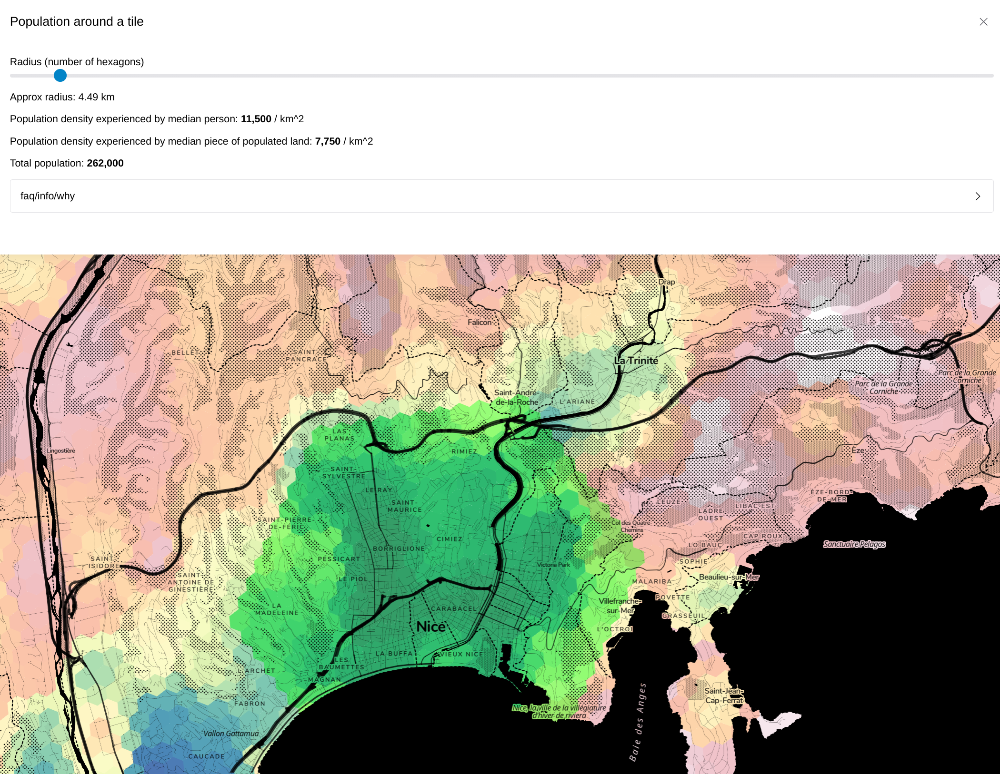

# Population around a tile

<a href="https://o.blanthorn.com/population-around-a-tile/map/">Visit the map here</a>

A 'simple' data vis tool using MapLibre GL and deck.gl to display a pre-computed population hex grid itself tiled by hexes and served from a bog-standard HTTP server.

# How to run

Prerequisites: yarn. A web browser

0. `git clone`
1. `yarn install`
2. `yarn serve&; yarn watch`, open localhost:1983

If you have updated src/app.js, remember to run `yarn build` and commit map/src.js or GitHub pages won't commit anything.

# h3 tile layer

somehow foursquare managed to trademark 'hex tiles', absolutely insane. i wonder which regular polygon they'll go for next. so we need to think of a name. {6}-tiles maybe which as a bonus is totally obtuse. but honestly the trademark is so clearly unjustifiable that we should genericise it like hoover.

anyway need to formalise the format spec etc.

at the moment it's /res={res}/h3_parent={string_index}/part0.arrow, where h3_parent is the resolution specified, and part0.arrow is an uncompressed arrow file of index: uint64, value: float 0-1.

todo:

- extract to a library
- make getFillColor etc configurable
- support template string for url
- add meta.json for valid resolutions rather than hardcoding odd ones? maybe we can/should adapt map style.json?
- investigate 'z-fighting' glitches when moving

- make layers clickable again
